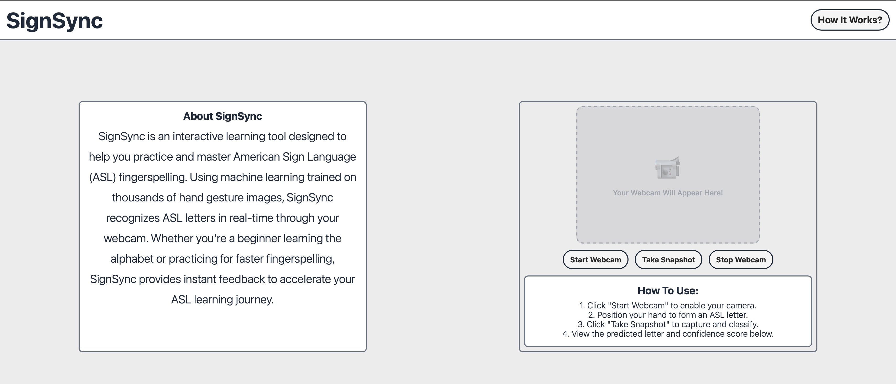

# SignSync

**Real-time American Sign Language Recognition in the Browser**

[](https://signsync-webapp.onrender.com)
[](https://python.org)
[](https://www.tensorflow.org/js)
[](https://mediapipe.dev)
[](https://flask.palletsprojects.com)
[](LICENSE)
[](https://render.com)

SignSync is a web application that recognizes American Sign Language (ASL) gestures in real-time using your webcam. All machine learning inference runs directly in your browser - no server-side processing required.

**[Try the Live Demo](https://signsync-webapp.onrender.com)**

<p align="center">
  
</p>

---

## Table of Contents

- [Features](#features)
- [Recognition Capabilities](#recognition-capabilities)
- [Architecture](#architecture)
- [Tech Stack](#tech-stack)
- [Getting Started](#getting-started)
- [Project Structure](#project-structure)
- [Model Configuration](#model-configuration)
- [Model Training and Conversion](#model-training-and-conversion)
- [Deployment](#deployment)
- [API Reference](#api-reference)
- [Contributing](#contributing)
- [Troubleshooting](#troubleshooting)
- [License](#license)

---

## Features

- **Real-time Recognition** - Instant ASL gesture detection using your webcam
- **Browser-based Inference** - All ML processing runs locally in your browser for privacy and speed
- **Multi-landmark Tracking** - Simultaneous pose, face, and hand tracking for comprehensive gesture analysis
- **Visual Feedback** - Live landmark visualization overlay on video feed
- **Confidence Scoring** - Each prediction includes a confidence percentage
- **Swappable Models** - Easy model updates via configuration file
- **Privacy-first** - No video data sent to servers; all processing is client-side
- **Mobile-friendly** - Responsive design works on desktop and mobile browsers
- **Free Tier Compatible** - Designed to run on Render's free hosting tier

---

## Recognition Capabilities

SignSync is designed to recognize:

| Category | Examples |
|----------|----------|
| **ASL Alphabets** | A-Z (26 letters) |
| **Numbers** | 0-9 |
| **Common Words** | hello, thank you, I love you etc. |
| **Simple Sentences** | Multi-sign phrases and expressions |

> **Note**: The currently deployed model recognizes a subset of gestures. Additional gestures can be added by training and deploying an updated model.

---

## Architecture

SignSync uses a client-side machine learning architecture where all inference runs in the browser:

```
+------------------+     +----------------------+     +------------------+
|     Webcam       | --> |   MediaPipe (WASM)   | --> |   TensorFlow.js  |
|   Video Feed     |     |   Landmark Extraction |     |   LSTM Model     |
+------------------+     +----------------------+     +------------------+
                                   |                           |
                                   v                           v
                         +------------------+         +------------------+
                         |   1692 Keypoints |         |   Prediction     |
                         |    per Frame     |         |   + Confidence   |
                         +------------------+         +------------------+
```

### Keypoint Extraction

MediaPipe extracts **1692 keypoints per frame** from three landmark models:

| Model | Landmarks | Coordinates | Total Values |
|-------|-----------|-------------|--------------|
| **Pose** | 33 landmarks | x, y, z, visibility | 132 |
| **Face** | 478 landmarks | x, y, z | 1434 |
| **Left Hand** | 21 landmarks | x, y, z | 63 |
| **Right Hand** | 21 landmarks | x, y, z | 63 |
| **Total** | - | - | **1692** |

### LSTM Processing

The LSTM model processes **30-frame sequences** (approximately 1 second of video at 30fps):

- **Input shape**: `[batch, 30, 1692]`
- **Output**: Probability distribution over gesture classes
- **Inference**: Runs on every frame once the buffer is full (sliding window)

### Data Flow

1. **Webcam** captures video frames at 30fps
2. **MediaPipe** (running via WebAssembly) extracts landmarks from each frame
3. **Buffer** accumulates 30 frames of keypoint data
4. **TensorFlow.js** runs the LSTM model on the buffered sequence
5. **UI** displays the predicted gesture with confidence score

---

## Tech Stack

| Layer | Technology | Purpose |
|-------|------------|---------|
| **Frontend** | HTML5, CSS3, JavaScript | User interface and interaction |
| **ML - Landmarks** | MediaPipe Vision Tasks | Pose, face, and hand landmark extraction |
| **ML - Inference** | TensorFlow.js | LSTM model execution in browser |
| **Backend** | Flask | Static file serving |
| **WSGI** | Gunicorn | Production server |
| **Deployment** | Render | Cloud hosting (free tier) |

### Why This Architecture?

- **Privacy**: Video never leaves the user's device
- **Speed**: No network latency for inference
- **Cost**: No GPU servers required; runs on free hosting
- **Scalability**: Server load is minimal (static files only)

---

## Getting Started

### Prerequisites

- Python 3.11 or higher
- A modern web browser (Chrome, Firefox, Edge, Safari)
- Webcam access

### Installation

1. **Clone the repository**

   ```bash
   git clone https://github.com/theChosen-1/SignSync-WebApp.git
   cd SignSync-WebApp
   ```

2. **Create a virtual environment**

   ```bash
   python -m venv venv
   source venv/bin/activate  # On Windows: venv\Scripts\activate
   ```

3. **Install dependencies**

   ```bash
   pip install -r requirements.txt
   ```

4. **Set up environment variables** (optional for development)

   ```bash
   cp .env.example .env
   ```

5. **Run the development server**

   ```bash
   python app.py
   ```

6. **Open your browser**

   Navigate to [http://localhost:5001](http://localhost:5001)

### Quick Start

1. Click the **Start** button to enable your webcam
2. Position yourself so your upper body is visible
3. Perform ASL gestures
4. View real-time predictions with confidence scores

---

## Project Structure

```
SignSync-WebApp/
├── app.py                      # Flask application (routes only)
├── requirements.txt            # Python dependencies
├── render.yaml                 # Render deployment configuration
├── convert_model.py            # Keras to TensorFlow.js converter
├── .env.example                # Environment variable template
│
├── template/
│   ├── index.html              # Main application page
│   └── docs.html               # "How It Works" documentation
│
├── static/
│   ├── script.js               # MediaPipe + TensorFlow.js integration
│   ├── style.css               # Main application styles
│   ├── docStyle.css            # Documentation page styles
│   ├── model_config.json       # Model configuration and labels
│   ├── images/                 # Static images
│   └── tfjs_model/             # TensorFlow.js model files
│       ├── model.json          # Model architecture
│       └── group1-shard*.bin   # Model weights
│
├── tests/                      # Test suite
│   └── test_app.py             # Flask route tests
│
└── gesture_model.keras         # Source Keras model (for conversion)
```

---

## Model Configuration

The model behavior is controlled by `static/model_config.json`:

```json
{
    "labels": ["hello", "thanks", "iloveyou"],
    "sequenceLength": 30,
    "keypointSize": 1692,
    "confidenceThreshold": 0.7,
    "version": "1.0.0",
    "description": "LSTM model for ASL gesture recognition",
    "keypointBreakdown": {
        "pose": 132,
        "face": 1434,
        "leftHand": 63,
        "rightHand": 63,
        "total": 1692
    }
}
```

### Configuration Options

| Field | Description |
|-------|-------------|
| `labels` | Array of gesture class names (in order of model output) |
| `sequenceLength` | Number of frames to buffer before inference |
| `keypointSize` | Total keypoints per frame (must match model input) |
| `confidenceThreshold` | Minimum confidence for high-confidence display (0-1) |

### Swapping Models

To use a different model:

1. Convert your Keras model to TensorFlow.js format (see below)
2. Replace files in `static/tfjs_model/`
3. Update `static/model_config.json` with new labels
4. Deploy or restart the application

---

## Model Training and Conversion

### Training Data Format

The model expects input sequences with shape `[batch, 30, 1692]`:

- **30 frames** of sequential landmark data
- **1692 features** per frame (pose + face + hands)
- Features must be normalized (0-1 range from MediaPipe)

### Converting Keras to TensorFlow.js

Use the provided conversion script:

```bash
# Create a separate environment (requires Python 3.10 or 3.11)
python3.11 -m venv tfjs_env
source tfjs_env/bin/activate

# Install conversion dependencies
pip install tensorflow==2.15.0 tensorflowjs==4.17.0

# Run conversion
python convert_model.py
```

Alternatively, use Docker:

```bash
docker run -it --rm -v $(pwd):/app -w /app python:3.11-slim bash -c "
    pip install tensorflow==2.15.0 tensorflowjs==4.17.0 &&
    python convert_model.py
"
```

The script will:
1. Load `gesture_model.keras`
2. Convert to TensorFlow.js LayersModel format
3. Save to `static/tfjs_model/`

### Model Requirements

Your Keras model should:
- Accept input shape `(None, 30, 1692)`
- Output a probability distribution over gesture classes
- Use layers supported by TensorFlow.js (LSTM, Dense, Dropout, etc.)

---

## Deployment

### Deploy to Render

1. **Fork or push to GitHub**

2. **Create a new Web Service on [Render](https://render.com)**

3. **Connect your repository**

4. **Render auto-detects `render.yaml`** and configures:
   - Python 3.11 runtime
   - Build: `pip install -r requirements.txt`
   - Start: `gunicorn --bind 0.0.0.0:$PORT --workers 2 --threads 2 --timeout 120 app:app`
   - Health check: `/health`
   - Auto-deploy on push

5. **Your app will be live** at `https://your-app.onrender.com`

### Environment Variables

| Variable | Description | Required |
|----------|-------------|----------|
| `SECRET_KEY` | Flask secret key | Yes (auto-generated on Render) |
| `FLASK_DEBUG` | Enable debug mode | No (default: False) |
| `PORT` | Server port | No (default: 10000 on Render) |

### Free Tier Considerations

SignSync is optimized for Render's free tier:
- **Minimal server load**: Flask only serves static files
- **No GPU required**: All ML runs in browser
- **Small footprint**: ~50MB total deployment size
- **Cold starts**: First request may take 30-60 seconds to spin up

---

## API Reference

### Routes

| Method | Endpoint | Description |
|--------|----------|-------------|
| GET | `/` | Main application page |
| GET | `/docs` | "How It Works" documentation |
| GET | `/health` | Health check endpoint |

### Health Check Response

```json
{
  "status": "healthy",
  "timestamp": "2024-01-15T12:30:45.123456",
  "version": "2.0.0",
  "message": "Frontend ready - ML model coming soon"
}
```

---

## Contributing

Contributions are welcome! Here's how to get started:

### Development Setup

1. Fork the repository
2. Create a feature branch: `git checkout -b feature/amazing-feature`
3. Make your changes
4. Run tests: `pytest`
5. Commit: `git commit -m 'Add amazing feature'`
6. Push: `git push origin feature/amazing-feature`
7. Open a Pull Request

### Running Tests

```bash
# Run all tests
pytest

# Run with coverage report
pytest --cov=app --cov-report=term-missing

# Run specific test file
pytest tests/test_app.py
```

### Code Style

- Python: Follow PEP 8
- JavaScript: Use consistent formatting (4-space indentation)
- CSS: Use BEM-style class naming

### Areas for Contribution

- Add support for more ASL gestures
- Improve model accuracy
- Add mobile-specific optimizations
- Create training data collection tools
- Write documentation or tutorials
- Report and fix bugs

---

## Troubleshooting

### Camera Not Working

| Issue | Solution |
|-------|----------|
| Permission denied | Click the camera icon in browser address bar and allow access |
| No camera found | Connect a webcam and refresh the page |
| Camera in use | Close other applications using the camera |
| HTTPS required | Use localhost or deploy with HTTPS |

### Model Not Loading

| Issue | Solution |
|-------|----------|
| 404 on model files | Ensure `static/tfjs_model/model.json` exists |
| Tensor shape mismatch | Verify `model_config.json` matches model architecture |
| WebGL errors | Try a different browser or disable GPU acceleration |

### Poor Recognition Accuracy

| Issue | Solution |
|-------|----------|
| Low confidence scores | Ensure good lighting and plain background |
| Incorrect predictions | Keep entire upper body in frame |
| Delayed predictions | Wait for buffer to fill (30 frames) |

### Deployment Issues

| Issue | Solution |
|-------|----------|
| Build fails | Check `requirements.txt` for syntax errors |
| App crashes on start | Verify `SECRET_KEY` is set in production |
| Slow initial load | Normal on free tier (cold start); wait 30-60 seconds |

---

## License

MIT License

Copyright (c) 2024 inshaal81

Permission is hereby granted, free of charge, to any person obtaining a copy
of this software and associated documentation files (the "Software"), to deal
in the Software without restriction, including without limitation the rights
to use, copy, modify, merge, publish, distribute, sublicense, and/or sell
copies of the Software, and to permit persons to whom the Software is
furnished to do so, subject to the following conditions:

The above copyright notice and this permission notice shall be included in all
copies or substantial portions of the Software.

THE SOFTWARE IS PROVIDED "AS IS", WITHOUT WARRANTY OF ANY KIND, EXPRESS OR
IMPLIED, INCLUDING BUT NOT LIMITED TO THE WARRANTIES OF MERCHANTABILITY,
FITNESS FOR A PARTICULAR PURPOSE AND NONINFRINGEMENT. IN NO EVENT SHALL THE
AUTHORS OR COPYRIGHT HOLDERS BE LIABLE FOR ANY CLAIM, DAMAGES OR OTHER
LIABILITY, WHETHER IN AN ACTION OF CONTRACT, TORT OR OTHERWISE, ARISING FROM,
OUT OF OR IN CONNECTION WITH THE SOFTWARE OR THE USE OR OTHER DEALINGS IN THE
SOFTWARE.

---

<p align="center">
  Built with care by <a href="https://github.com/inshaal81">inshaal81</a>
</p>
